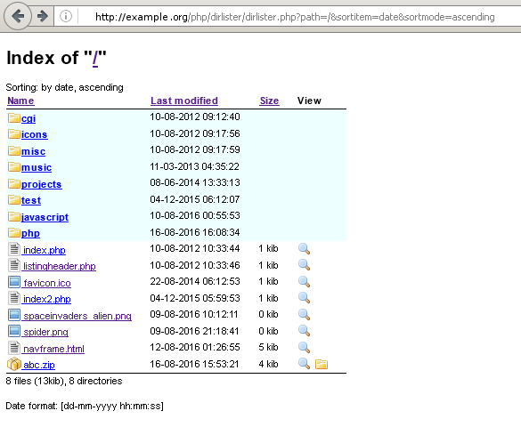

# dirlister
PHP directory lister with ZIP archive browsing and extraction support  
  
You only need "dirlister.php". Icons to use and more can be configured in the configuration section of "dirlister.php".
See ["dirlister.php"](dirlister.php) for further info and usage.  
  
Screenshots:  
 
